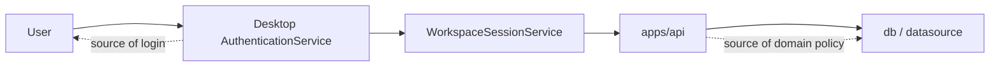
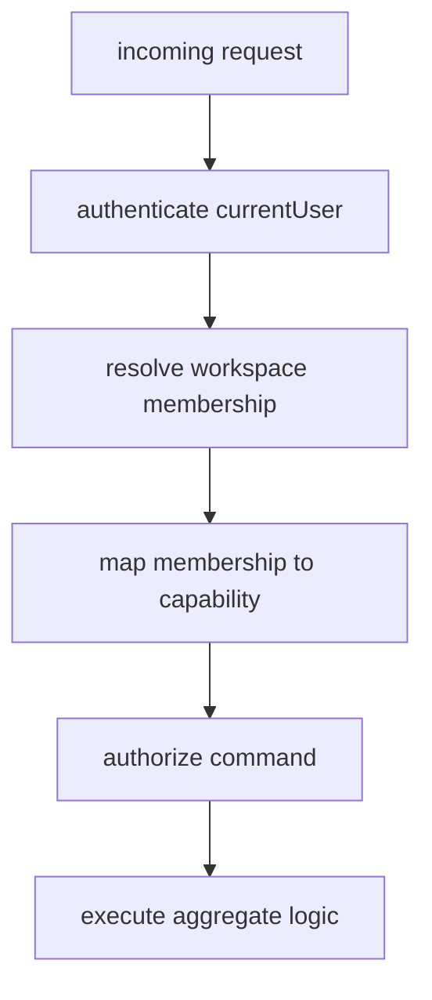

# 서버 측 인증과 인가 정책

## 한 줄 설명

현재 Harness Docs의 서버는 도메인 판단과 데이터 권위를 소유하지만, 사용자 인증의 source of truth는 아직 desktop 쪽에 더 가깝다. 이 문서는 현재 서버가 무엇을 검증하고 무엇을 아직 검증하지 않는지 정리한다.

## 현재 상태

현재 `apps/api`는 다음을 수행한다.

- Hono 기반 API 제공
- datasource 선택
- document aggregate / publish aggregate 계산
- publish governance preflight projection

현재 `apps/api`가 아직 직접 소유하지 않는 것:

- GitHub OAuth 세션 수립
- bearer token 검증
- server-side session store
- 요청 단위 사용자 인증 강제

즉, 현재 구조는 `desktop-authenticated client -> API bootstrap and domain calls`에 가깝다.

## 현재 경계

핵심:

- 로그인 여부는 현재 desktop이 먼저 판단한다.
- 도메인 규칙은 API가 authoritative하게 판단한다.

## 서버가 현재 authoritative하게 판단하는 것

### 문서 도메인

- review 상태
- approval 상태
- invalidation 기반 freshness
- prePublication readiness

관련 소스:

- `apps/api/src/domain/documentAggregate.ts`

### publish 도메인

- stale rationale 필요 여부
- unresolved approval preflight
- publish record preflight status
- publish governance preflight projection

관련 소스:

- `apps/api/src/domain/publishAggregate.ts`
- `apps/api/src/domain/publishGovernanceProjection.ts`
- `apps/api/src/domain/publishGovernanceAdapter.ts`

## 서버가 아직 authoritative하지 않은 것

### 1. 요청 주체 인증

현재 코드 기준으로 API route는 요청자가 누구인지 강제적으로 확인하지 않는다.

즉 아직 없는 것:

- `Authorization` 헤더 처리
- GitHub access token 검증
- app session cookie 검증
- request context에 `currentUser` 주입

### 2. workspace membership 기반 접근 제어

현재 도메인과 mock data에는 역할 개념이 있다.

- `Lead`
- `Editor`
- `Reviewer`

그러나 API route 단에서 아직 일관된 authorization gate로 강제되지는 않는다.

즉 아직 비어 있는 규칙:

- 어떤 role이 어떤 workspace를 읽을 수 있는가
- 어떤 role이 document를 수정할 수 있는가
- 어떤 role이 approval request/decision을 수행할 수 있는가
- 어떤 role이 publish execute를 수행할 수 있는가

### 3. command별 권한 정책

현재 route는 기능은 제공하지만, command별 권한 매트릭스는 아직 문서화와 구현이 부족하다.

예시:

- `POST /documents`
- `PATCH /documents/:documentId`
- `POST /documents/:documentId/approvals/request`
- `POST /approvals/:approvalId/decision`
- `POST /publish-records`
- `POST /publish-records/:publishRecordId/execute`

이 각각에 대해 `Lead`, `Editor`, `Reviewer`의 허용/거부 규칙이 아직 완전히 닫히지 않았다.

## 권장 authorization 모델

현재 코드 구조를 기준으로 가장 자연스러운 방향은 다음이다.

### Authentication

서버는 요청마다 `currentUser`를 복원해야 한다.

후보:

- GitHub OAuth 이후 app-owned session token
- signed cookie
- server-side session store

권장:

- GitHub token을 매 요청마다 직접 trust하지 말고
- app-owned session을 발급한 뒤 API가 그 세션을 검증

### Authorization

서버는 `currentUser -> workspaceMembership -> capability` 순서로 판단해야 한다.

권장 판단 흐름:

### Capability 예시

현재 desktop 모델을 기준으로 capability는 아래처럼 정리하는 것이 자연스럽다.

- `canEditDocuments`
- `canManageApprovals`
- `canPublish`
- `canAdministerWorkspace`

즉 route가 role 문자열을 직접 비교하기보다 capability를 기준으로 허용하는 편이 낫다.

## 권장 command policy 초안

아래는 현재 도메인 구조에 맞는 초안이다.

### Workspace read

- `Lead`: 허용
- `Editor`: 허용
- `Reviewer`: 허용

### Document create/update

- `Lead`: 허용
- `Editor`: 허용
- `Reviewer`: 기본 거부

### Approval request

- `Lead`: 허용
- `Editor`: 제한적 허용 가능
- `Reviewer`: 기본 거부

### Approval decision

- reviewer identity와 membership authority가 일치할 때만 허용
- `restored` 같은 lead-only decision은 `Lead`만 허용

### Publish preflight read

- workspace 접근 가능한 사용자면 허용

### Publish execute

- `canPublish = true`인 membership만 허용
- execute 시점에 preflight 재검증 필요

## 가장 부족한 부분

현재 서버 측 인증/인가에서 제일 부족한 부분은 아래 네 가지다.

### 1. currentUser 부재

API가 지금은 `누가 요청했는지`를 강하게 모른다.

### 2. membership resolution 부재

사용자가 특정 workspace에 속하는지 route 단에서 일관되게 체크하지 않는다.

### 3. command authorization 부재

command별 권한 정책이 route guard로 구현되어 있지 않다.

### 4. preflight와 execute 사이 재검증 부재

읽은 preflight와 실제 execute 시점 상태가 달라질 수 있다.

## 권장 구현 순서

현실적인 순서는 아래가 맞다.

1. API request context에 `currentUser` 주입
2. workspace membership resolution helper 추가
3. capability 기반 authorization helper 추가
4. route별 authorize 적용
5. publish execute 직전 authoritative re-check 추가

## 현재 문서와의 관계

같이 보면 좋은 문서:

- [인증과 로그인](/Users/sondi/Documents/github/projects/apps/desktop/docs/authentication.md)
- [아키텍처](/Users/sondi/Documents/github/projects/packages/contracts/docs/architecture.md)
- [도메인 모델](/Users/sondi/Documents/github/projects/packages/contracts/docs/domain-model.md)
- [Publish Governance RPC](/reference/publish-governance-rpc)
