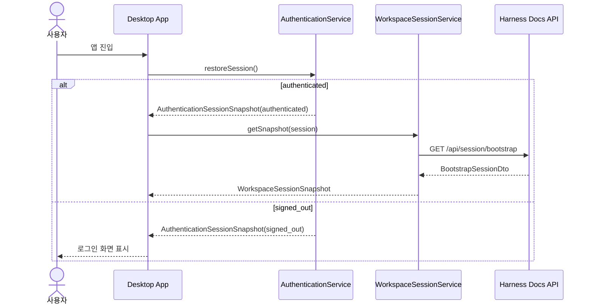
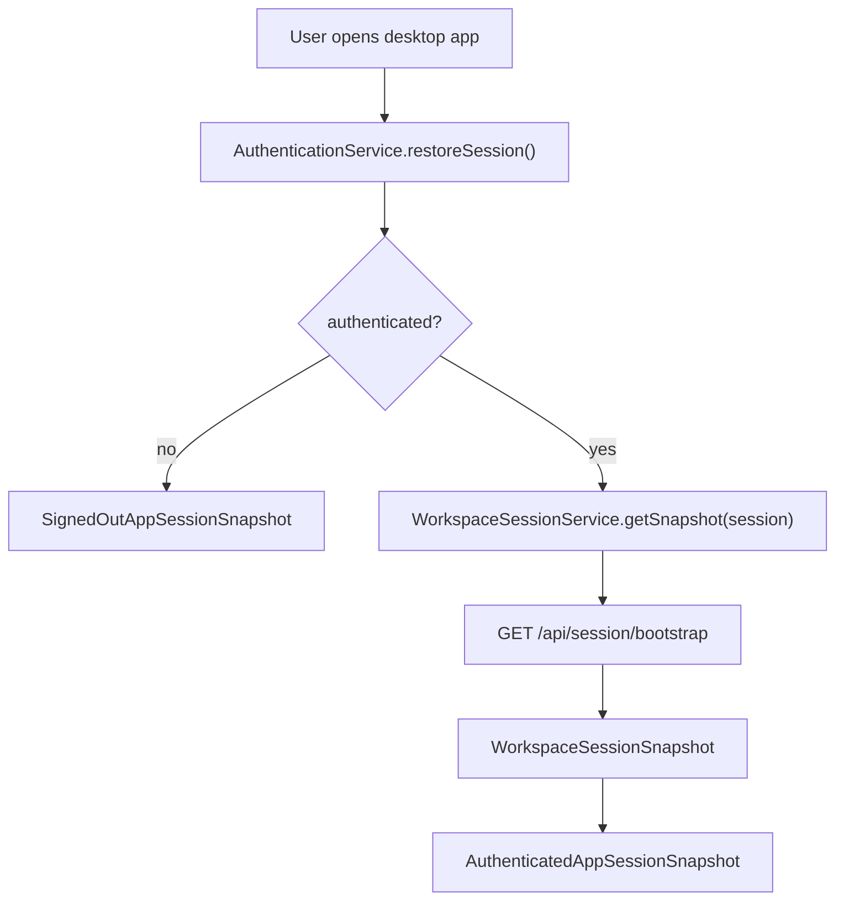

# 인증과 로그인

## 한 줄 설명

Harness Docs의 로그인은 `GitHub OAuth -> desktop authentication session -> workspace bootstrap` 순서로 이어진다.

## 현재 범위

현재 구현 기준의 인증 범위는 다음과 같다.

- 인증 provider는 `github_oauth` 하나다.
- 인증 세션 상태는 `authenticated` 또는 `signed_out` 두 가지다.
- desktop은 인증 세션을 복원한 뒤 workspace session bootstrap을 시도한다.
- browser/mock 환경에서는 저장소 기반 mock 세션을 사용한다.
- Tauri 환경에서는 네이티브 command를 통해 GitHub 인증 세션을 복원하거나 시작한다.

관련 소스:

- `apps/desktop/src/services/contracts.ts`
- `apps/desktop/src/services/mockHarnessDocsServices.ts`
- `apps/desktop/src/services/tauriHarnessDocsServices.ts`
- `apps/desktop/src/services/rpcWorkspaceSession.ts`
- `apps/api/src/server.ts`

## 핵심 타입

인증 서비스 경계는 `apps/desktop/src/services/contracts.ts`에 있다.

### `AuthenticationProviderDescriptor`

- `id`
- `label`
- `kind`
- `loginCtaLabel`

현재 값:

- `id = github_oauth`
- `kind = oauth`

### `AuthenticationSessionSnapshot`

union:

- `AuthenticatedSessionSnapshot`
- `SignedOutSessionSnapshot`

즉, 데스크톱 앱은 로그인 여부를 복잡한 중간 상태보다 명시적인 두 상태로 본다.

### `AppSessionSnapshot`

union:

- signed out:
  `authentication = signed_out`, `workspace = null`
- authenticated:
  `authentication = authenticated`, `workspace = WorkspaceSessionSnapshot`

이 구조 때문에 workspace bootstrap은 로그인 이후에만 수행된다.

## 로그인 흐름

## Browser / Mock 환경

출처:

- `apps/desktop/src/services/mockHarnessDocsServices.ts`

browser/mock 환경의 동작은 다음과 같다.

### provider

- provider는 여전히 `github_oauth`로 고정한다.

### 세션 저장

- storage key: `harness-docs/mock-auth-session`
- 값이 `signed_out`이면 로그아웃 상태
- 그 외에는 `authenticated`

### `restoreSession()`

- local storage에서 상태를 읽는다.
- authenticated면 `mockSession.user`를 반환한다.
- signed out이면 `user = null`을 반환한다.

### `startSignIn()`

- provider가 `github_oauth`인지 확인한다.
- storage를 `authenticated`로 쓴다.
- mock user 기반 인증 세션을 반환한다.

### `signOut()`

- storage를 `signed_out`으로 쓴다.
- signed out 세션을 반환한다.

## Tauri / GitHub OAuth 환경

출처:

- `apps/desktop/src/services/tauriHarnessDocsServices.ts`

Tauri 환경에서는 인증 상태를 desktop app이 직접 계산하지 않고 command layer를 통해 받는다.

### 사용 command

- `get_github_authentication_session`
- `start_github_sign_in`
- `sign_out_github`

### `restoreSession()`

- runtime이 `tauri`가 아니면 signed out 반환
- runtime이 `tauri`면 `get_github_authentication_session` command 호출
- 반환된 GitHub identity를 앱의 `SessionUser` shape로 변환

### `startSignIn()`

- provider가 `github_oauth`인지 검증
- tauri runtime이 아니면 에러
- `start_github_sign_in` command 호출
- GitHub identity를 앱 세션으로 변환

### `signOut()`

- tauri runtime이면 `sign_out_github` command 호출
- 결과를 signed out 또는 authenticated 세션으로 다시 매핑

## GitHub identity -> 앱 사용자 매핑

Tauri 서비스는 raw GitHub user를 앱의 `SessionUser`로 바꾼다.

매핑 규칙:

- `handle = @${githubLogin}`
- `avatarInitials = name 또는 login 기반 이니셜`
- `primaryEmail = GitHub email이 없으면 mock fallback`

즉, 인증 provider는 GitHub지만 desktop 내부 세션은 제품 고유 타입으로 유지한다.

## Workspace bootstrap 연결

출처:

- `apps/desktop/src/services/rpcWorkspaceSession.ts`

인증이 성공했다고 바로 workspace 데이터가 생기는 것은 아니다.

다음 단계가 필요하다.

1. `AuthenticationSessionSnapshot.status === authenticated`
2. `WorkspaceSessionService.getSnapshot(session)` 호출
3. RPC client가 `GET /api/session/bootstrap` 호출
4. `BootstrapSessionDto`를 `WorkspaceSessionSnapshot`으로 매핑

fallback 규칙:

- RPC bootstrap 실패 시 mock snapshot 사용
- 단 user는 현재 authentication session의 user로 덮어쓴다

이 구조 덕분에 인증과 workspace bootstrap이 분리된다.

## 인증과 API의 관계

현재 `apps/api/src/server.ts`는 인증 provider를 직접 소유하지 않는다.

현재 API가 하는 일:

- Hono server 시작
- datasource 선택
- publish governance adapter 연결

즉, 현재 로그인 구조는 desktop 주도형이다.

- desktop이 인증 세션을 복원
- desktop이 bootstrap 호출
- API는 bootstrap 응답 제공

장기적으로 서버 측 session 검증이나 token 검증이 붙더라도, 현재 문서 기준 source of truth는 desktop authentication service 쪽에 있다.

## 현재 구현의 한계

### provider 다양성 없음

- 현재는 `github_oauth`만 지원한다.

### token/credential 문서화 부족

- access token 저장 위치
- refresh 규칙
- 만료 처리
- API 요청 인증 헤더 규칙

은 아직 현재 문서 범위에 없다.

### server-side auth 정책 부족

- API가 지금은 bootstrap과 도메인 응답을 중심으로 동작한다.
- 실제 사용자 권한 검증과 GitHub identity 검증은 더 강화되어야 한다.

### 로그인 화면과 route 문서 부족

- 현재 file-based route 리팩터링 중이라 로그인 route 문서는 안정화 이후 보강 필요

## Mermaid 구조도

## 구현 파일별 책임

### `apps/desktop/src/services/contracts.ts`

- authentication 관련 public service contract
- session snapshot union 정의

### `apps/desktop/src/services/mockHarnessDocsServices.ts`

- browser/mock 인증 상태 복원
- mock sign-in/sign-out
- local storage 상태 관리

### `apps/desktop/src/services/tauriHarnessDocsServices.ts`

- Tauri command 기반 GitHub OAuth 연동
- raw GitHub identity -> 앱 세션 매핑

### `apps/desktop/src/services/rpcWorkspaceSession.ts`

- 인증 이후 workspace bootstrap RPC 호출
- bootstrap fallback 관리

### `apps/api/src/server.ts`

- API startup
- 현재 인증 provider 로직은 직접 소유하지 않음

## 지금 추천되는 다음 문서

이 문서 다음으로 분리하면 좋은 주제는 두 가지다.

1. `desktop route auth flow`
2. `server-side auth and authorization policy`
