# 도메인 코드 Mermaid 정리

## 문서 목적

이 문서는 현재 Harness Docs의 publish governance 도메인 코드를 Mermaid 다이어그램으로 정리한 기술 문서다.

대상 범위는 다음 파일들이다.

- `packages/contracts/src/publish-governance.ts`
- `packages/contracts/src/index.ts`
- `apps/api/src/domain/documentAggregate.ts`
- `apps/api/src/domain/publishAggregate.ts`
- `apps/api/src/domain/publishGovernanceProjection.ts`
- `apps/api/src/domain/publishGovernanceAdapter.ts`
- `apps/api/src/data/mockWorkspaceSessionSource.ts`
- `apps/api/src/data/postgresWorkspaceSessionSource.ts`
- `apps/desktop/src/lib/publishGovernanceView.ts`
- `apps/desktop/src/domain/publishing.ts`

## 1. 전체 경계 구조

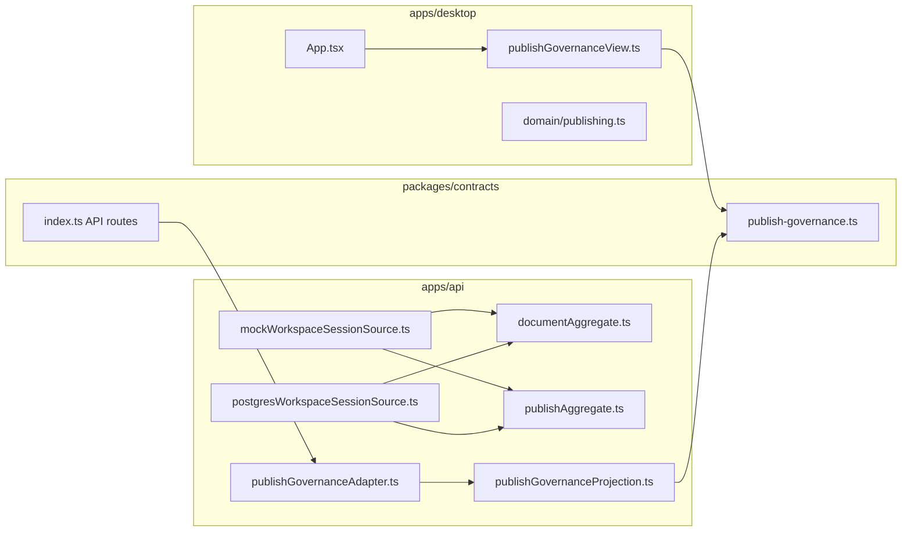

핵심 해석:

- `contracts`가 정책 타입과 API 경로를 소유한다.
- `api`는 aggregate 결과를 contracts snapshot으로 바꾼 뒤 projection 한다.
- `desktop`은 자체 모델을 contracts snapshot으로 바꿔 같은 정책 view를 읽는다.
- `api`와 `desktop`은 서로의 내부 타입을 직접 참조하지 않는다.

## 2. Document Aggregate 상태 모델

출처:

- `apps/api/src/domain/documentAggregate.ts`

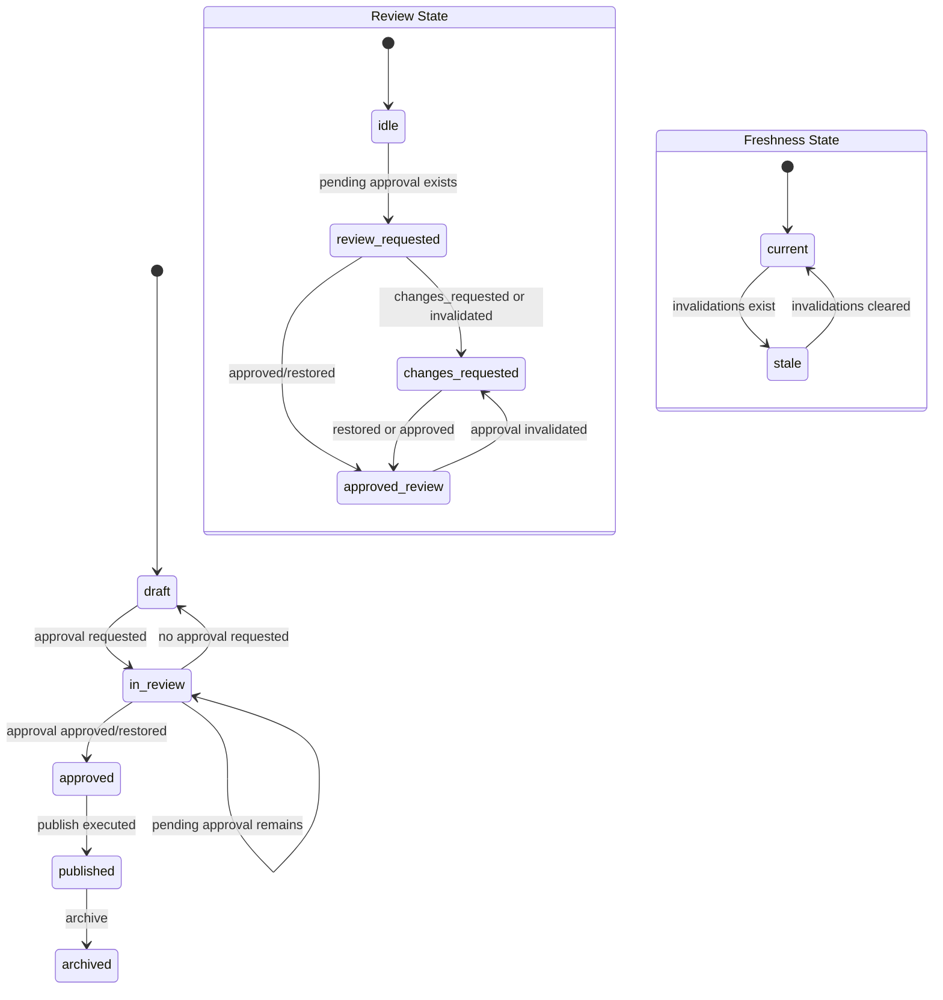

핵심 규칙:

- 문서 저장 상태와 review 상태는 분리된다.
- freshness는 `invalidations` 존재 여부에 의해 계산된다.
- `prePublicationReadiness`는 `ready`, `attention_required`, `blocked`로 별도 계산된다.

## 3. Document Aggregate 계산 흐름

출처:

- `apps/api/src/domain/documentAggregate.ts`

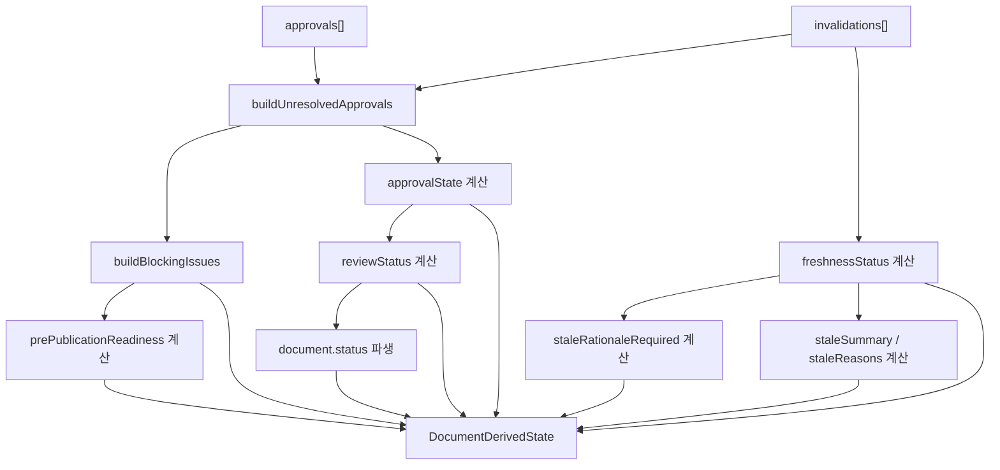

이 다이어그램이 보여주는 것:

- aggregate는 원시 DB row를 직접 노출하지 않는다.
- approval, invalidation, freshness, blocking issue를 합성해서 `DocumentDerivedState`를 만든다.
- publish 정책 판단의 전제 데이터는 여기서 대부분 결정된다.

## 4. Publish Aggregate 구조

출처:

- `apps/api/src/domain/publishAggregate.ts`

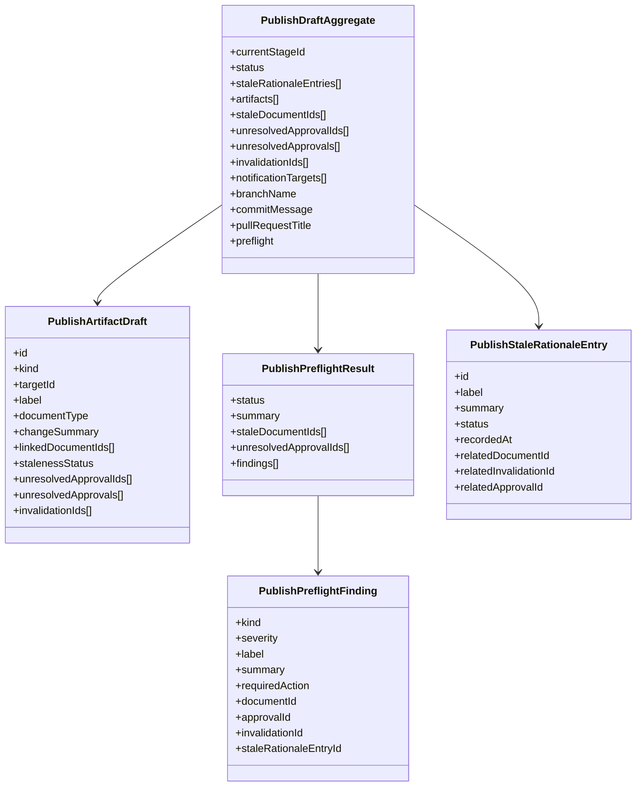

## 5. Publish Aggregate 단계 흐름

출처:

- `apps/api/src/domain/publishAggregate.ts`

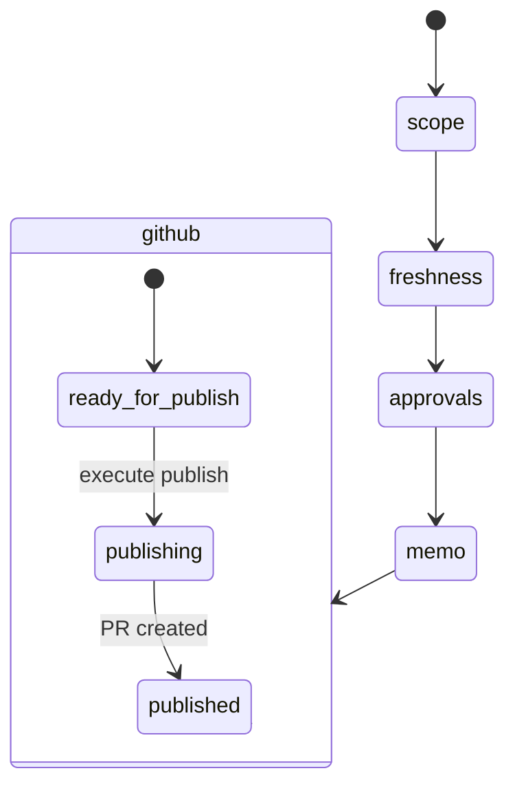

단계 정의는 `publishStageDefinitions`가 소유한다.

- `scope`
- `freshness`
- `approvals`
- `memo`
- `github`

이건 UI 화면 단계이면서 publish record의 진행 상태 문서이기도 하다.

## 6. Publish Preflight 계산

출처:

- `apps/api/src/domain/publishAggregate.ts`

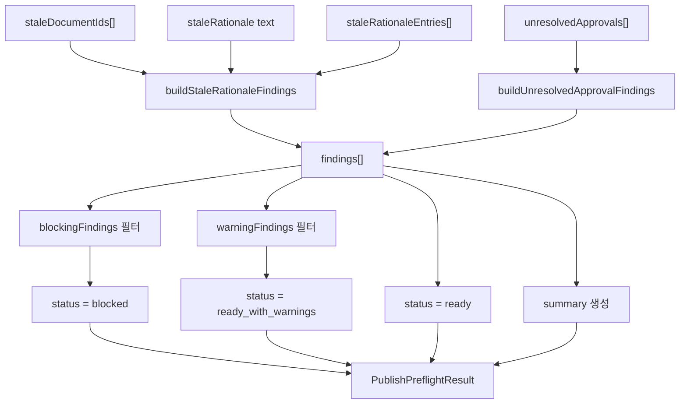

핵심 정책:

- stale 문서는 rationale이 없으면 `blocking`
- stale 문서는 rationale이 있으면 `warning`
- unresolved approval은 상태에 따라 `warning` 또는 `blocking`

## 7. Contracts 상태 기계

출처:

- `packages/contracts/src/publish-governance.ts`

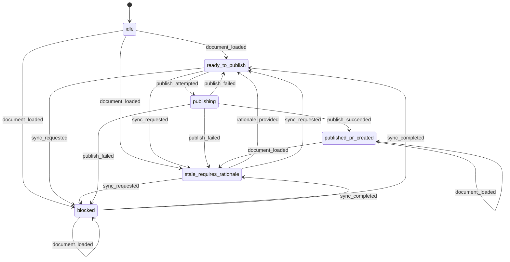

이 다이어그램은 `publishFlowTransitionMap`을 거의 그대로 시각화한 것이다.

## 8. Contracts 타입 관계

출처:

- `packages/contracts/src/publish-governance.ts`

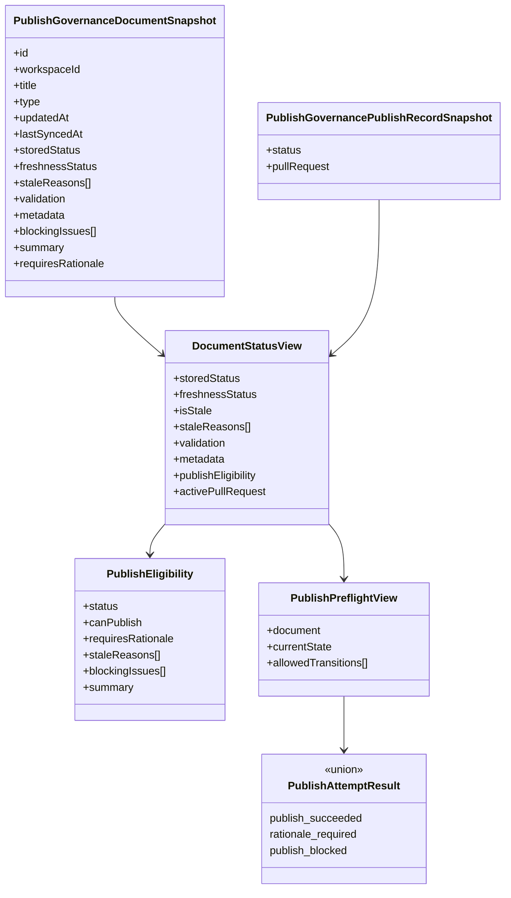

## 9. API Projection 파이프라인

출처:

- `apps/api/src/domain/publishGovernanceAdapter.ts`
- `apps/api/src/domain/publishGovernanceProjection.ts`
- `packages/contracts/src/index.ts`

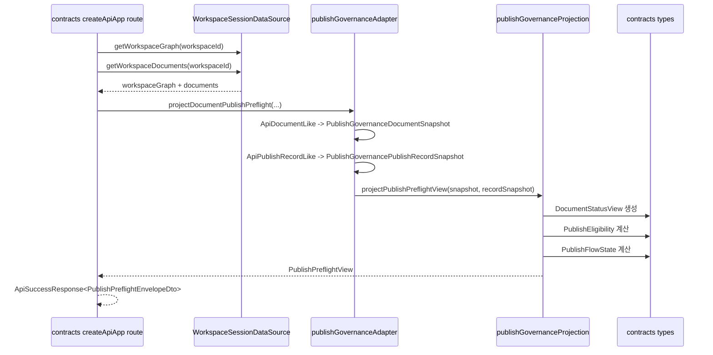

핵심 경계:

- route는 `contracts`에 있다
- adapter는 `apps/api`에 있다
- projection 입력/출력 타입은 전부 `contracts`에 있다
- `api`는 `desktop` 타입을 import하지 않는다

## 10. Desktop Projection 파이프라인

출처:

- `apps/desktop/src/lib/publishGovernanceView.ts`
- `apps/desktop/src/App.tsx`

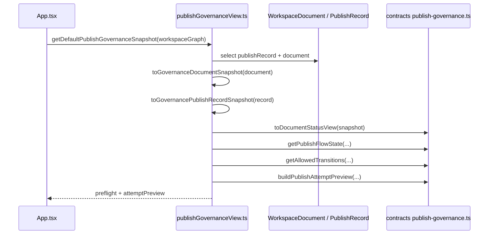

핵심 의미:

- desktop도 contracts snapshot을 거친다
- UI가 직접 policy를 계산하지 않는다
- UI는 상태와 전이 결과를 읽고 렌더만 한다

## 11. Data Source에서 도메인으로 가는 흐름

출처:

- `apps/api/src/data/mockWorkspaceSessionSource.ts`
- `apps/api/src/data/postgresWorkspaceSessionSource.ts`

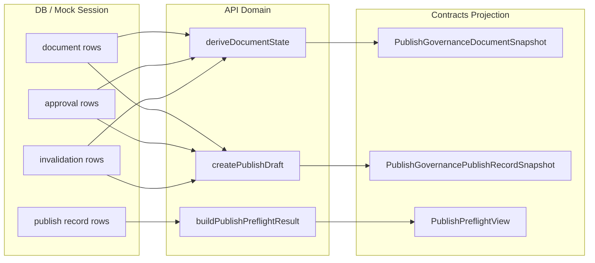

## 12. Publish 시도 결과 Union

출처:

- `packages/contracts/src/publish-governance.ts`
- `apps/api/src/domain/publishGovernanceProjection.ts`
- `apps/desktop/src/lib/publishGovernanceView.ts`

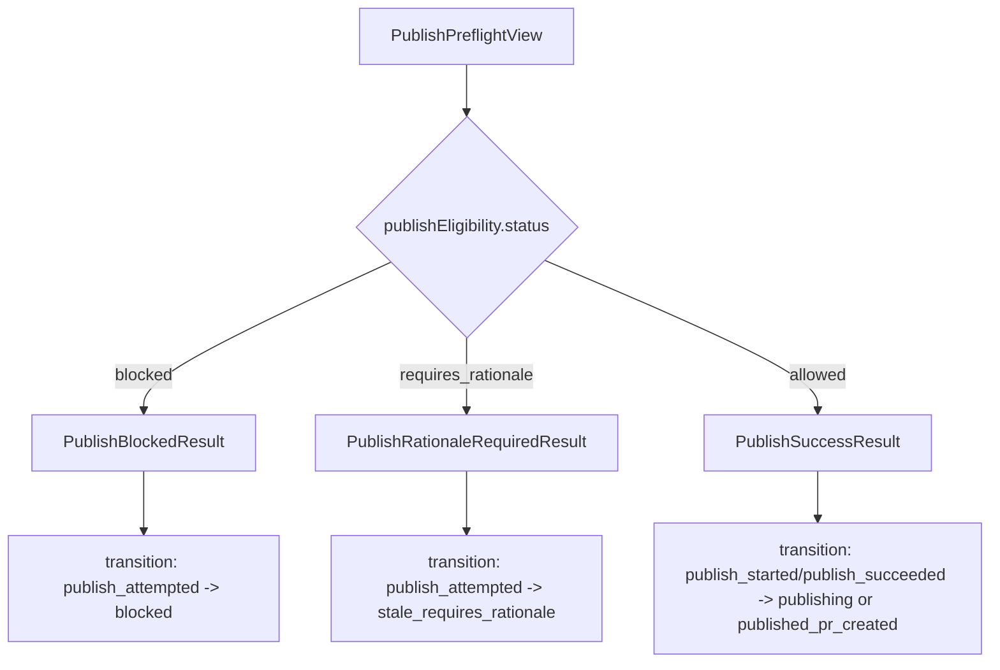

이 union 덕분에 caller는 문자열 조합이 아니라 `kind` 기준으로 분기한다.

## 13. 권장 읽기 순서

코드를 읽을 때는 아래 순서가 가장 낫다.

1. `packages/contracts/src/publish-governance.ts`
2. `apps/api/src/domain/documentAggregate.ts`
3. `apps/api/src/domain/publishAggregate.ts`
4. `apps/api/src/domain/publishGovernanceProjection.ts`
5. `apps/api/src/domain/publishGovernanceAdapter.ts`
6. `apps/desktop/src/lib/publishGovernanceView.ts`

## 14. 현재 구조의 결론

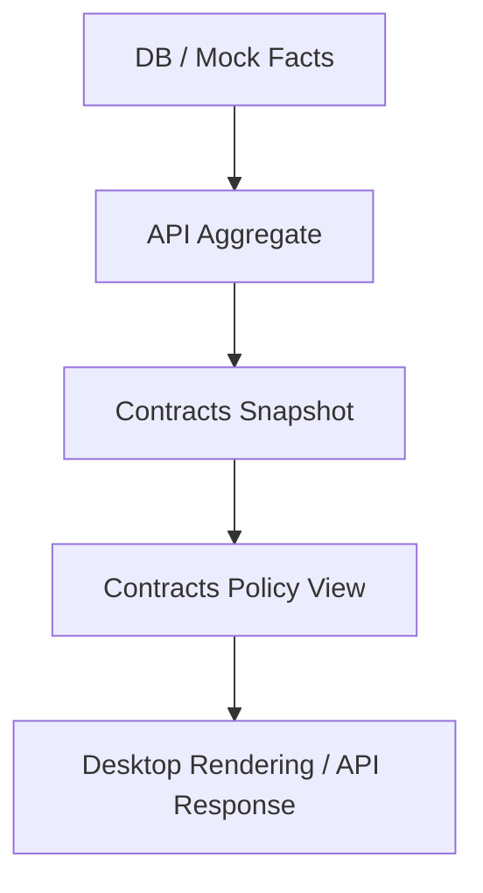

현재 구조의 핵심은 이것이다.

- 사실은 aggregate가 만든다
- 정책 표현은 contracts가 만든다
- API와 desktop은 각각 adapter를 가진다
- 타입이 곧 문서가 되도록 설계한다

## 15. 현재 도메인 개발의 공백

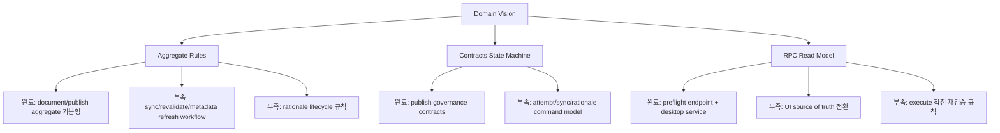

현재 핵심 공백은 아래 다섯 가지다.

- freshness 회복 절차가 aggregate 상태 기계로 완전히 모델링되지 않았다.
- rationale의 생성, 대체, 재사용, 만료 규칙이 부족하다.
- contracts state machine은 read 중심이고 command 모델은 아직 덜 연결됐다.
- desktop UI는 아직 `PublishPreflightView`를 최종 source of truth로 쓰지 않는다.
- preflight와 execute 사이 경쟁 조건을 막는 재검증 규칙이 없다.
