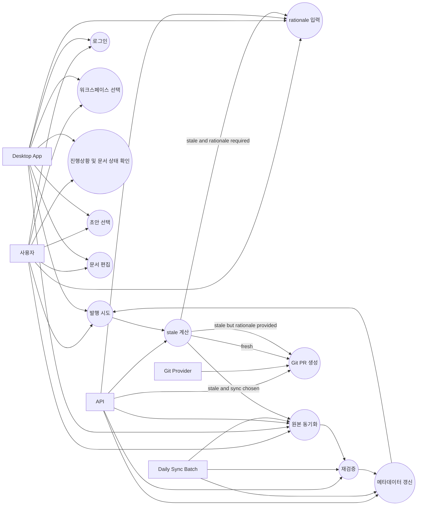
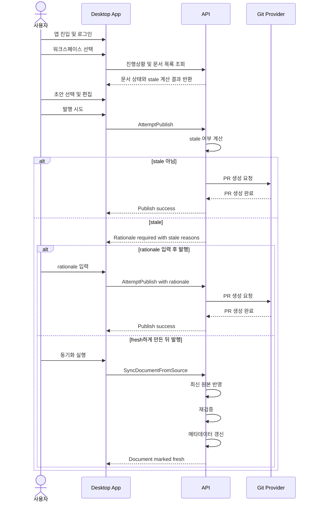

# 앱 진입부터 문서 발행까지 이벤트스토밍

## 문서 목적

이 문서는 Harness Docs의 "앱 진입부터 문서 발행까지" 흐름을 이벤트스토밍 결과로 정리한 워킹 드래프트다.

정리 범위는 다음과 같다.

- 사용자가 앱에 들어온다
- 로그인한다
- 워크스페이스를 선택한다
- 진행상황과 문서 상태를 확인한다
- 초안을 선택하고 편집한다
- 발행을 시도한다
- stale이면 rationale을 입력한다
- Git PR 생성으로 발행을 완료한다

## 워크숍 범위와 전제

- 시작점은 `사용자가 앱에 들어왔다` 이다.
- 종료점은 `문서 발행을 위한 Git PR이 생성되었다` 이다.
- 주 인터랙션 채널은 desktop 앱이다.
- 정책 판단은 API가 authoritative하게 수행한다.
- `stale`은 저장 상태가 아니라 조회 시점 계산 결과다.
- 매일 오전 10시 배치는 freshness 회복을 시도하는 운영 메커니즘이다.

## 핵심 용어

### 발행

이 문서에서 발행은 문서 내용이 GitHub Pull Request로 올라간 상태를 뜻한다.

즉, 발행 완료의 정의는 다음과 같다.

- Git PR 생성 성공

### stale

문서는 아래 조건 중 하나라도 만족하면 stale로 본다.

- `updatedAt` 기준으로 마지막 업데이트 이후 7일이 지났다
- 원본의 최신 변경이 문서에 실제 반영된 시각인 `lastSyncedAt`보다 뒤에 있다

### fresh

문서는 아래 조건이 모두 충족되면 fresh로 본다.

- 최신 원본이 문서에 재반영되었다
- 재검증이 완료되었다
- 메타데이터 갱신이 완료되었다

## 액터

- 사용자
- Desktop App
- API
- Daily Sync Batch
- Git Provider

## 메인 시나리오

1. 사용자가 앱에 진입한다.
2. 사용자가 로그인한다.
3. 사용자가 워크스페이스를 선택한다.
4. 사용자가 진행상황과 문서 목록, 문서 상태를 확인한다.
5. 사용자가 초안을 선택한다.
6. 사용자가 문서를 편집한다.
7. 사용자가 발행을 시도한다.
8. API가 문서의 stale 여부와 발행 가능 여부를 계산한다.
9. 문서가 stale가 아니면 API가 Git PR 생성 orchestration을 시작한다.
10. Git PR이 생성되면 발행 완료로 간주한다.

## 예외 시나리오

1. 사용자가 발행을 시도한다.
2. API가 문서를 stale로 판정한다.
3. API는 stale 이유와 함께 rationale 입력이 필요하다고 반환한다.
4. 사용자는 rationale을 입력하고 발행을 재시도할 수 있다.
5. 또는 사용자는 동기화 버튼을 실행한다.
6. API 또는 배치가 최신 원본 반영, 재검증, 메타데이터 갱신을 수행한다.
7. 문서가 fresh 판정을 받으면 사용자가 rationale 없이 다시 발행을 시도할 수 있다.

## 커맨드

- `Login`
- `SelectWorkspace`
- `ViewWorkspaceDashboard`
- `OpenDocument`
- `EditDocument`
- `AttemptPublish`
- `ProvideStalePublishRationale`
- `SyncDocumentFromSource`
- `RevalidateDocument`
- `RefreshDocumentMetadata`
- `CreatePublishPullRequest`

## 도메인 이벤트

- `UserLoggedIn`
- `WorkspaceSelected`
- `WorkspaceDashboardViewed`
- `DocumentOpened`
- `DocumentEdited`
- `PublishAttempted`
- `DocumentStaleEvaluated`
- `StalePublishRationaleRequested`
- `StalePublishRationaleProvided`
- `DailySyncBatchTriggered`
- `DocumentSyncStarted`
- `SourceContentSynced`
- `DocumentRevalidated`
- `DocumentMetadataRefreshed`
- `DocumentMarkedFresh`
- `PublishPullRequestCreationStarted`
- `PublishPullRequestCreated`

## 정책

- 문서가 7일 이상 업데이트되지 않으면 stale이다.
- 원본의 최신 변경이 문서에 실제 반영되지 않았으면 stale이다.
- stale 문서는 rationale이 있으면 발행할 수 있다.
- fresh 상태는 원본 반영, 재검증, 메타데이터 갱신이 모두 완료되어야 한다.
- 발행 완료의 정의는 Git PR 생성 성공이다.

## Aggregate 후보

핵심 aggregate 후보는 `Document`다.

`Document`가 최소한 보유해야 하는 사실 데이터는 다음과 같다.

- `updatedAt`
- `lastSyncedAt`
- `validationStatus`
- `metadataStatus`
- `publishStatus`
- `pullRequestId` 또는 `pullRequestUrl`

이 중 `stale`과 `fresh`는 저장 필드가 아니라 API가 계산하는 파생 정책 상태로 본다.

## 상태 모델

저장 상태와 계산 상태를 분리해서 본다.

### 저장 상태

- `draft`
- `publishing`
- `published_pr_created`

### 계산 상태

- `fresh`
- `stale`
- `sync_required`
- `validation_required`
- `metadata_refresh_required`

## 읽기 모델

Desktop App이 바로 소비할 읽기 모델은 다음과 같다.

### WorkspaceDashboard

- 진행상황
- stale 문서 수
- 발행 가능 문서 수

### DocumentListItem

- 문서 ID
- 제목
- 현재 상태
- `isStale`
- `updatedAt`
- `lastSyncedAt`
- 발행 가능 여부

### DocumentDetail

- 편집 본문
- 원본 동기화 상태
- 검증 결과
- 메타데이터 상태
- stale rationale 필요 여부
- PR 상태

## Publish 계약 초안

Desktop과 API 사이의 최소 계약은 아래 수준까지는 필요하다.

### `DocumentStatusView`

- `documentId`
- `updatedAt`
- `lastSyncedAt`
- `isStale`
- `staleReasons`
- `requiresRationaleForPublish`
- `publishEligibility`

### `PublishEligibility`

- `canPublish`
- `requiresRationale`
- `staleReasons`
- `validationIssues`
- `metadataIssues`

### `AttemptPublish` 결과

- `accepted`
- `requiresRationale`
- `staleReasons`
- `pullRequestId`
- `pullRequestUrl`

정책상 `accepted=false`와 `requiresRationale=true`는 hard failure가 아니라 추가 입력 요청이다.

## 경계별 책임

### `apps/desktop`

- 로그인 이후 사용자 흐름 구성
- 워크스페이스 선택
- 진행상황과 문서 상태 표시
- stale 사유 표시
- 동기화 버튼과 발행 버튼 제공
- 사용자 입력 수집

### `apps/api`

- stale 계산
- fresh 판정
- 발행 가능 여부 판정
- 매일 오전 10시 배치 처리
- Git PR 생성 orchestration

### `packages/contracts`

- `DocumentFreshness`
- `PublishEligibility`
- `PublishAttemptResult`
- `DocumentStatusView`

### `packages/db`

- 문서 원시 필드 저장
- freshness 계산에 필요한 시각 데이터 저장
- 검증 상태와 메타데이터 상태 저장
- PR 연결 정보 저장

## 오픈 이슈

현재 워크숍 결과에는 다음 확인 포인트가 남아 있다.

- rationale 입력 UI의 최소 요구사항을 별도로 정리해야 한다.
- stale rationale이 publish record에 어떤 형식으로 저장되는지 contracts와 db에서 구체화해야 한다.

## Mermaid Use Case

## Mermaid Sequence

